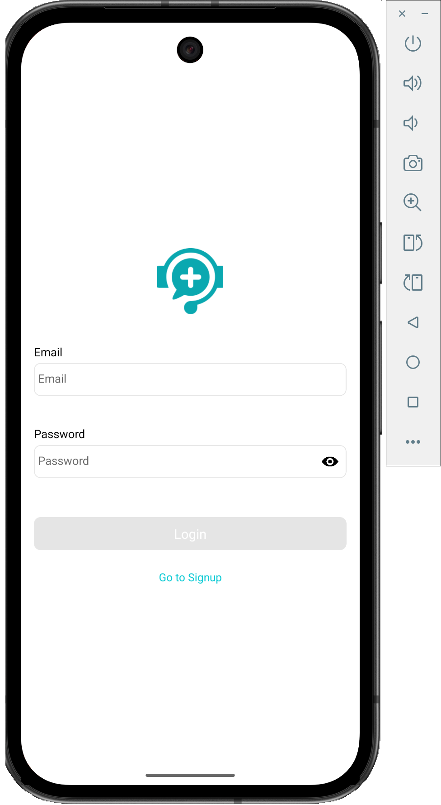
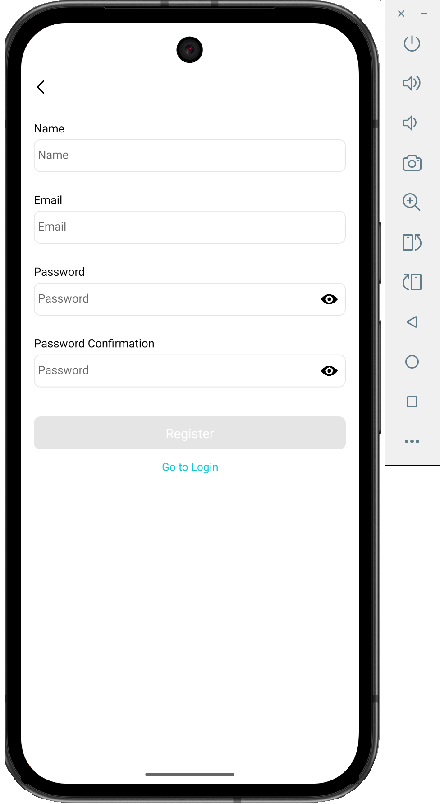
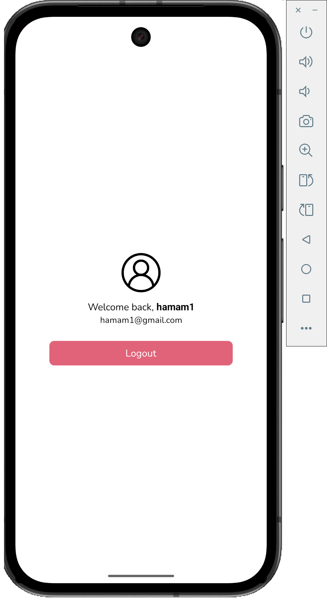

# Auth App

A robust React Native authentication application featuring Splash, Login, Registration, and Home screens. This project demonstrates a complete authentication flow using Context API for state management, AsyncStorage for data persistence, and React Hook Form with Yup for secure and validated form handling.

## Features

- **User Authentication**: Secure Login and Registration flows.
- **Splash Screen**: Initial loading screen for seamless user experience.
- **Form Validation**: Real-time validation using `react-hook-form` and `yup`.
- **State Management**: Global auth state management using React Context API.
- **Persistence**: User session persistence using `@react-native-async-storage/async-storage`.
- **Navigation**: Stack navigation handling for Auth and Non-Auth states.
- **UI/UX**: Clean interface with custom components and toast notifications.

## Screenshots

|                  Login Screen                   |                  Register Screen                   |                   Home/Profile                    |
| :---------------------------------------------: | :------------------------------------------------: | :-----------------------------------------------: |
|  |  |  |

## Folder Structure

The project follows a scalable and organized structure:

```
src/
├── assets/          # Static assets like images
├── components/      # Reusable UI components (Input, Button, etc.)
├── constants/        # App constants (Colors, StorageKeys)
├── context/         # React Context (AuthContext)
├── interface/       # TypeScript interfaces and types
├── navigation/      # Navigation configuration (Auth vs App stacks)
├── pages/           # Application screens (Splash, Login, Register, Home)
├── schema/          # Validation schemas (Yup)
└── utils/           # Helper functions
```

## Prerequisites

Before you begin, ensure you have the following installed:

- [Node.js](https://nodejs.org/) (>= 20)
- [React Native CLI](https://reactnative.dev/docs/environment-setup) environment setup (Android Studio/Xcode)

## Installation & Setup

1. **Clone the repository**

2. **Install dependencies**

   ```bash
   npm install
   # or
   yarn install
   ```

3. **iOS Setup (Mac only)**

   ```bash
   cd ios
   pod install
   cd ..
   ```

4. **Run the Application**

   Start Metro Bundler:

   ```bash
   npm start
   ```

   Run on Android:

   ```bash
   npm run android
   ```

   Run on iOS:

   ```bash
   npm run ios
   ```

## Key Dependencies

- `react-native`: 0.83.1
- `@react-navigation/native`: Navigation
- `react-hook-form`: Form management
- `yup`: Schema validation
- `@react-native-async-storage/async-storage`: Local storage
- `react-native-toast-message`: Toast notifications
